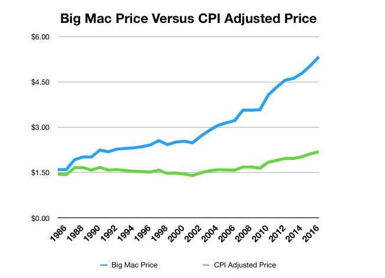
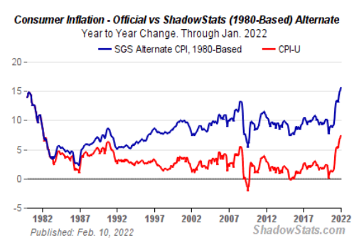
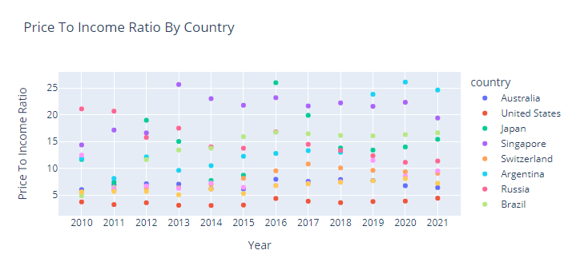
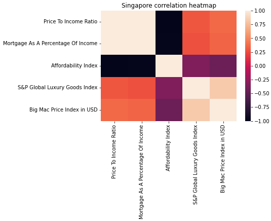
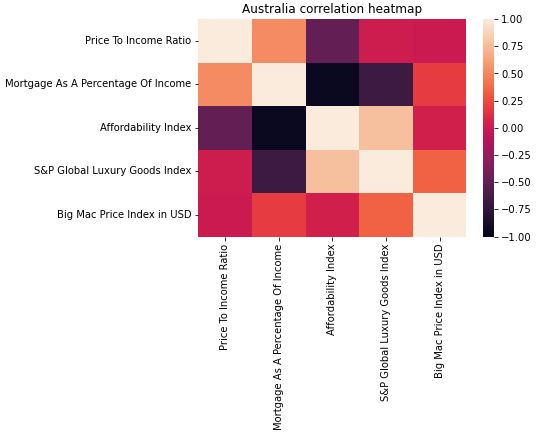

# Title:
### Global Property Affordability vs Big Mac Index vs SMP Global Luxury Goods Index.
----
## Course:
### USY Fintech Bootcamp 
----
## Group Members:
### Antonio Albuquerque
### Craig Braganza
### Jacky Hong 
------
# Date: 22 Feb 2022

# Motivation & Summary Slide

*   ###  The main objective of this project is to understand the relationship between different economic factors and housing affordability. We hypothesize that the lower the housing affordability, the higher inflation will be, increasing he cost of goods.

*   ###  We have used the Big Mac Index, which tracks the price of a Big Mac in different countries - it's also used as a light-hearted attempt to show the loss of purchasing power across different countries.

*   ### A basket of goods used today to track CPI is different from the bask of goods used in the 1990s. Today US' CPI is approximately 7.5%, however, if you take into account bask of goods used in the 1990's CPI would approach 15%

reference - http://www.shadowstats.com/alternate_data/inflation-charts

## Questions 
    1 - Which countries offer the best housing affordability 
    2 - Which country has the highest income to asset disparity 
    3 - What is the relationship between affordability and the Big Mac index 

## Answers 

    1 - We have chosen ten countries from different continents with different economic stability, and out of these ten countries. Our data analysis has shown that the US has the highest housing affordability, and Argentina has the lowest. In 2021, the US has an affordabiloty idex of 4.4. which means it was 6.6 times more affordable to buy in a house in USA than in Argentina.  

    2 - Our data analysis rendered some interesting data points. Our data shows that Japan's price to income ratio had risen from 7.7 in 2014 to a peak of 25.97 in 2016. Research pointed out that Japan was facing fast economic growth since exiting a recession in 2015, coinciding with the BOJ announcement of negative interest rates in 2016. Further research led to some interesting facts: In the 1980's Japan lived through a superbubble due to governmental stimulus. This inflated the real estate market to the point that Tokyo's Imperial Palace was worth more than all of California. At this same time, membership for one of Japan's most exclusive country clubs could cost as much as ¥400 million (US$3.7 million) – the cost of entire golf courses in other countries.

    3 - We wanted to establish if and how the Big Mac Index and S&P 500 Global Luxury Goods Index can be used to indicate housing affordability in any country. To do this, we analysed the correlation between the Big Mac Index and the three other metrics of housing affordability. Our correlation analysis, together with heatmap and Parallel Coordinates plotting has led us to believe that there is no definitive correlation between a countries housing affordability to its Big Mac Index and the Global Luxury Goods Index.

On The Big Mac Index:

•	Singapore and Russia had an inverse correlation between its Big Mac Index to its affordability Index

•	Mexico, Brazil, Argentina, and Switzerland had an inverse correlation between its Big Mac Index to its Price to Income Ratio and Mortgage as a Percentage of Income. 

•	Australia and Canada, USA and Japan, showed no significant correlation between the Big Mac Index to any of the three Affordability metrics.

On The S&P 500 Global Luxury Goods Index:

•	Australia had positive correlation between The Global Luxury Goods Index and affordability index, but showed inverse correlation to Mortgage as a percentage of Income.

•	USA, Singapore, Switzerland, Argentina, Brazil, Canada had an inverse correlation between The Global Luxury Goods Index and the affordability index.

•	Russia had an inverse correlation between The Global Luxury Goods Index and both Price to Income Ratio and Mortgage as a percentage of Income

•	Japan and Mexica show no significant correlation between The Global Luxury Goods Index to any of the three Affordability metrics.

    

*   Define the core message or hypothesis of the project.

*   Describe the questions that were asked, and why they were asked.
*   Describe whether the questions were answered to your satisfaction, and briefly summarize the findings.

# Data Cleanup & Exploration

### Describe the exploration and cleanup process.
*   ### Once we figured out what data we needed, we slowly worked through all the importing files. we had three different groups of data we needed to clean up and work with:
    1 - Housing affordability data (including price to income ratio, mortgage as a percentage of income, and affordability index).
    
    2 - S&P 500 Global Luxury Goods Index
    
    3 - Global Big Mac Index

1 - *Housing Affordability data:*

Once we downloaded the data, we had data from more than 100 countries and many different data sets. Therefore, we wanted to clean up the data. It is indexed by country name and year with a price to income ratio, mortgage as a percentage of income, and affordability index as three separate columns.

2 - *S&P Luxury Goods index:*

For the Global Luxury goods Index, we had monthly data of price/open/close/high/low, etc, and we wanted to clean the data, so it shows the average price per year (index by year)

3 - *Big mac index:*

Unfiltered, The Big Mac Index, included the date, country, local price, and foreign currency price.
We cleaned the data to have the USD value of big mac in each country, the country name for our selected country, and the relevant years. We then separated the data by country and stored it as a variable for concatenation.

### Discuss any insights you had while exploring the data that you didn't anticipate.

*   ### We didn't anticipate some countries did have data for some years that we wanted to analyze. I.e., Big Mac Index data for China was missing for 2010.

### Discuss any problems that arose after exploring the data, and how they were resolved.

*   ### Our dataset showed data per city. However, however, we wanted to display data by country, so we had to clean up and re-structure the dataset into a new data frame to display the data that we needed to work with.

### Present and discuss interesting figures developed during exploration, ideally with the help of Jupyter Notebook.

*   ### We have noted that the affordability index negatively correlates with most other metrics that we used for the data analysis.

# Data Analysis

*   ### Once we have the housing affordability, luxury goods index, and big mac index sorted by country, we use the seaborne heat map and parallel coordinates to analyze the relationship between all the variables. This allows us to have a deeper look into each of these variables to draw our conclusions.

Discuss the steps taken to analyze the data, and answer each question that was asked in your proposal.
Present and discuss interesting figures developed during analysis, ideally with the help of Jupyter Notebook.

# Discussion

Discuss your findings. Did they meet your expectations, and if not, why? What inferences or general conclusions can be drawn from your analysis?

*   ### We have realized that the data available wasn't 100% reliable to provide an accurate picture of our Analysis, but we believe that we have established valuable correlation between the data that we have reviewed and have provided great insight in the Analysis. 
*   ### We have concluded that lower housing affordability negatively correlates to price to income ratio, luxury goods index, and the Big Mac Index. Meaning that housing prices can increase, lowering affordability and the daily living cost, which we believe pushes inflation higher, affecting people's disposable income.
*   ### However the correlations of the luxury goods index and big mac index to the other metrics vary in correlation, dependant on country. Therefore both cannot be used accurately as an indicator of housing affordability.

# Postmortem

Discuss any difficulties that arose, and how thesy were handled.
 - we originally wanted to get data from 2000 to 2021, but some selected countries didn't have enough data hence we updated our timeline to 2010 - 2021.
 - We had some issues with data cleaning (separating countries names) but was able to find a solution online ( will be explained during class)
Discuss any additional questions that arose which couldn't be answered due to time constraints.
What would you research next if you had two more weeks?
can add more variables into the data frame to determine what other factors may contribute to the fluctuation of housing prices, such as local central bank interest rates per country, economic growth (GDP etc.), population growth, etc

# Questions

Open-floor Q&A with the audience.

© 2020 Trilogy Education Services, a 2U, Inc. brand. All Rights Reserved